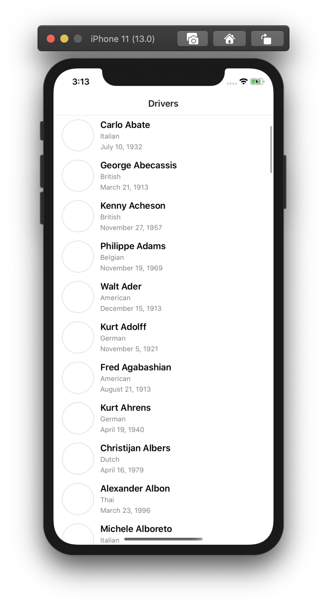
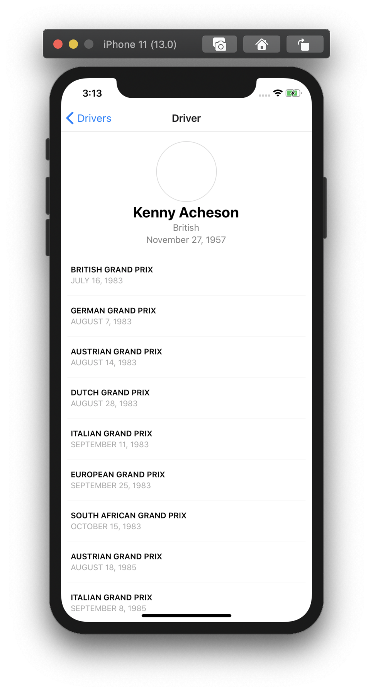

# Races

Тестовое задание на React Native.

Получение списка гонщиков и их результатов с [Ergast Developer API](http://ergast.com/mrd/).

<p align="center">
  
  
</p>


## Структура проекта

```md
src
├── components                       Слой представления
│   ├── containers                   View контейнеры
│   │   ├── App.tsx
│   │   ├── Driver                   Контейнер экрана 'Гонщика'
│   │   │   ├── DriverContainer.tsx  Содержит state и функции обработчики.
│   │   │   │
│   │   │   ├── DriverView.tsx       Верстка и стили компонента.
│   │   │   │                        Не содержит state, может иметь
│   │   │   │                        вспомогательные функции для
│   │   │   │                        преабразовывания данных,
│   │   │   │                        например форматирование даты.
│   │   │   │
│   │   │   ├── elements             UI элементы, которые относятся
│   │   │   │                        только к данному кейсу
│   │   │   │
│   │   │   └── index.tsx            Импорты компонентов
│   │   └── Drivers
│   ├── navigation                   Routing
│   └── shared                       Общие UI элементы (кнопки, элементы списка и т.п)
│
├── config                           Конфигурация приложения (API эндпоинты и т.п)
│   └── api.ts
│
└── store                            Слой стейт менеджера (redux)
    ├── models                       Описание сущностей бизнес-логики
    ├── modules                      Модули хранилища
    ├── reducer.ts                   Конфигурация редьюсеров
    ├── store.ts                     Инициализация хранилища
    └── types                        Вспомогательные типы
```

Структура похожа на "ванильную" структуру каждого проекта `React Native + Redux`, за исключением сильного дробления на доп. файлы.

Так каждый `redux` модуль содержит по 6 файлов - Action'ы и их типы, Reducer'ы + их типы, первоначальный стейт и ключи экшенов. Сделано это для более строгой типизации модулей, что позволяет писать более контролируемый код.

## Установка

Процесс установки не содержит чего-то нового и необычного. Достаточно склонировать репо и выполнить скрипт запуска react-native приложения:

```bash
$ git clone https://github.com/AlexMubarakshin/races-info.git

$ cd ./races-info

$ yarn

$ yarn ios
# Или для запуска на android
$ yarn andriod
```
